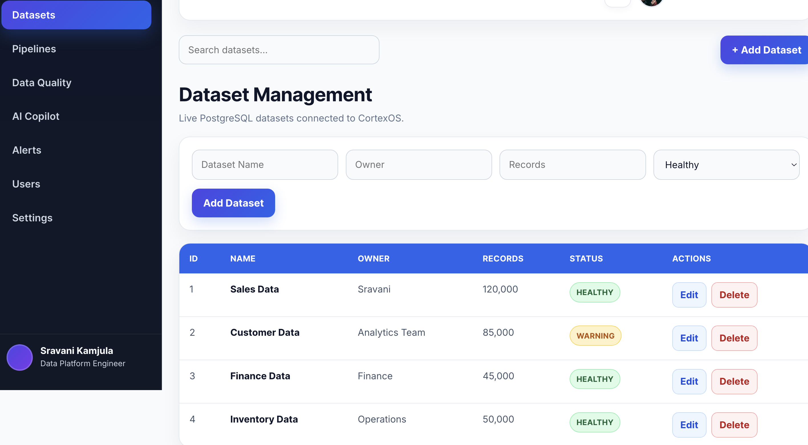
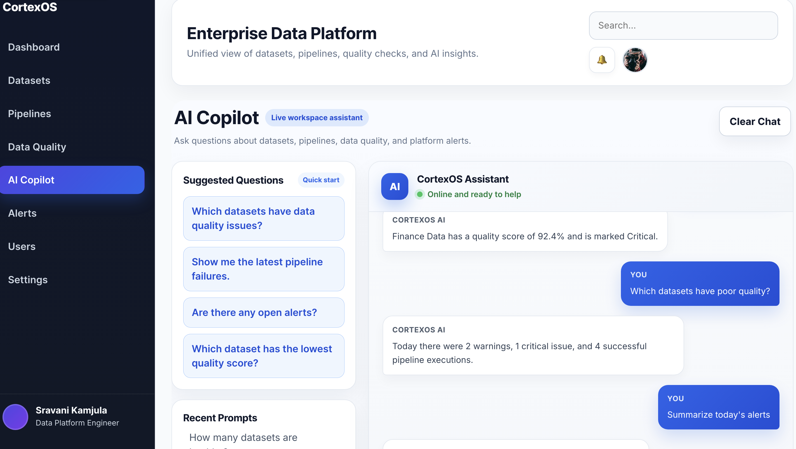
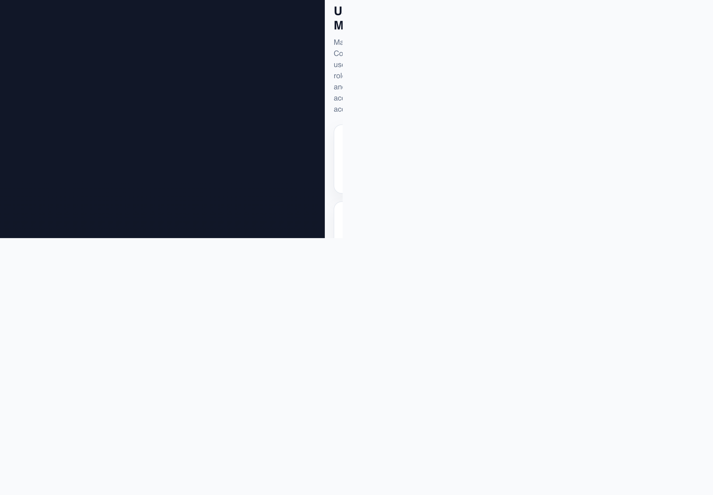
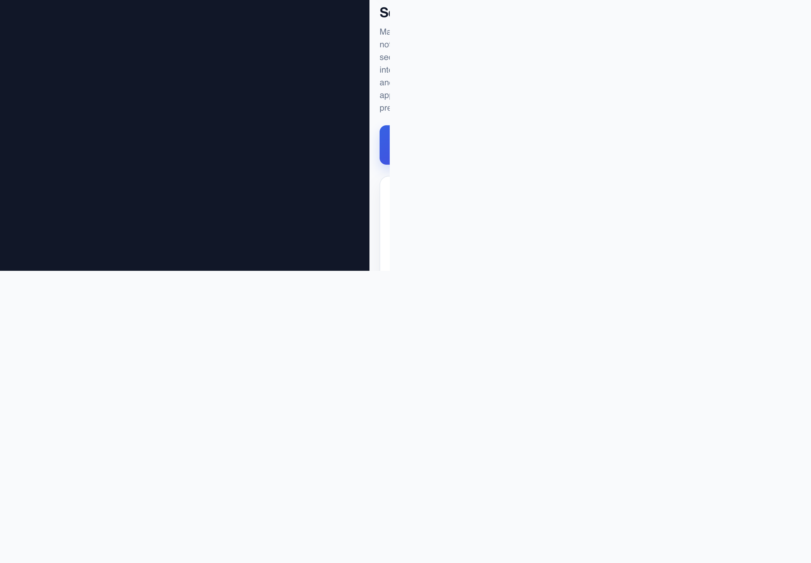

# CortexOS — Enterprise Data Platform


[GitHub Repository](https://github.com/kamjula/cortex-enterprise) • Live Demo: Coming Soon

> Enterprise Data Operations Platform with AI-Assisted Workflows
>
> **React • Node.js • Express • PostgreSQL**
>
> Pipeline Monitoring • Data Quality • Dataset Management • Alerts • AI Copilot
>
> ## Overview
>
> CortexOS is a full-stack enterprise data platform designed to help teams monitor data pipelines, improve data quality, manage datasets, track alerts, and explore AI-assisted operational workflows from a single workspace.
>
> Built with React, Node.js, Express, and PostgreSQL, the platform combines functional CRUD operations, REST APIs, pipeline execution workflows, data quality monitoring, and enterprise dashboard interfaces.
>
> ## Screenshots
>
> **Dashboard**
> 
>
> **Dataset Management**
> 
>
> **Pipeline Monitoring**
> 
>
> **Data Quality**
> 
>
> **Alerts Management**
> 
>
> **AI Copilot (UI Prototype)**
> 
>
> **User Management (UI Prototype)**
> 
>
> **Settings (UI Prototype)**
> 
>
> ## Tech Stack
>
> - **Frontend:** React 19, Vite, JavaScript, Recharts, Lucide React
> - - **Backend:** Node.js, Express.js
>   - - **Database:** PostgreSQL
>     - - **Design & Development Tools:** Git, GitHub, VS Code, Figma
>      
>       - ## Architecture
>      
>       - | Layer | Technology |
>       - |---|---|
>       - | Frontend | React + Vite |
> | Backend | Node.js + Express |
> | Database | PostgreSQL |
>
> **Application Flow:** React Frontend → Express REST API → PostgreSQL Database
>
> ## Project Status
>
> | Feature | Status |
> |---|---|
> | Dataset Management | Functional |
> | Pipeline Monitoring | Functional |
> | Data Quality | Functional |
> | Alerts Management | Functional |
> | AI Copilot | UI Prototype |
> | User Management | UI Prototype |
> | Settings | UI Prototype |
> | Authentication | Planned |
>
> Status definitions: Functional features are connected to the Express API and PostgreSQL. UI Prototype modules are navigable interface concepts that are not yet connected to persistent backend logic.
>
> ## Current Features
>
> - **Dataset Management:** Create, view, update, and delete datasets through a REST API backed by PostgreSQL.
> - - **Pipeline Monitoring:** Track pipeline status, trigger runs, retry failed executions, and review execution logs.
>   - - **Data Quality Dashboard:** Monitor quality scores, validation metrics, missing values, failed checks, and dataset-level trends.
>     - - **Alerts Management:** Create, view, update, resolve, and delete alerts with severity and status tracking.
>      
>       - ## UI Prototypes
>      
>       - - **AI Copilot:** Conversational interface prototype for exploring datasets, pipelines, alerts, and data quality information.
>         - - **User Management:** Enterprise-style interface for viewing users, roles, and account status.
>           - - **Settings:** Interface for notification, security, integration, and appearance preferences.
>            
>             - ## Highlights
>            
>             - - Enterprise dashboard with 8 integrated modules
>               - - Responsive modern user interface
>                 - - RESTful API architecture
>                   - - PostgreSQL database integration
>                     - - Dataset and alerts CRUD workflows
>                       - - Pipeline triggering, retry handling, and execution logs
>                         - - Data quality analytics and visualizations
>                           - - AI Copilot interface prototype
>                            
>                             - ## Demo Data
>                            
>                             - The `alerts` and `data_quality_checks` tables are populated using setup scripts included in this repository:
>                            
>                             - - `backend/setupAlerts.js` — creates the `alerts` table and inserts sample records (e.g., a pipeline failure alert, a data quality warning).
> - `backend/setupDataQuality.js` — creates the `data_quality_checks` table and inserts sample records (e.g., Sales Data, Customer Data, Finance Data, Inventory Data).
>
> - All seeded values are synthetic and used only to demonstrate functionality — no real company or personal data is included.
>
> - ## Current Limitations
>
> - - Authentication and role-based access control are not yet implemented; API routes are currently open.
>   - - AI Copilot, User Management, and Settings are UI prototypes only and are not yet connected to backend logic.
>     - - This repository does not currently include setup/seed scripts for the `datasets` or `pipelines` tables; automated setup scripts exist only for `alerts` and `data_quality_checks`.
>       - - No automated test suite is included yet.
>         - - No deployment or hosting configuration is included yet; the app is designed to run locally.
>          
>           - ## Roadmap
>          
>           - See the [open issues](https://github.com/kamjula/cortex-enterprise/issues) for planned improvements:
>          
>           - - JWT authentication
> - Role-based access control
> - - AI backend integration
>   - - Deployment configuration
>     - - Loading, empty, and error states
>       - - Production monitoring
>         - - Additional automated data quality checks
>          
>           - ## Getting Started
>          
>           - ### Prerequisites
>          
>           - - Node.js v18 or later
> - PostgreSQL running locally or remotely
> - - npm
>  
>   - ### Clone the Repository
>  
>   - ```bash
>     git clone https://github.com/kamjula/cortex-enterprise.git
>     cd cortex-enterprise
>     ```
>
> ### Configure the Backend
>
> ```bash
> cd backend
> cp .env.example .env
> ```
>
> Update `.env` with your PostgreSQL credentials:
>
> ```env
> DB_HOST=localhost
> DB_PORT=5432
> DB_USER=your_db_user
> DB_PASSWORD=your_db_password
> DB_NAME=cortexos
> ```
>
> ### Install and Run the Backend
>
> ```bash
> npm install
> node setupAlerts.js
> node setupDataQuality.js
> npm run dev
> ```
>
> The backend runs at `http://localhost:5050`.
>
> ### Install and Run the Frontend
>
> ```bash
> cd ../frontend
> npm install
> npm run dev
> ```
>
> Vite starts on the first available local port, normally `http://localhost:5173`.
>
> ## Author
>
> Sravani Kamjula
>
> - GitHub: [@kamjula](https://github.com/kamjula)
> - - Portfolio: [sravanikamjula.netlify.app](https://sravanikamjula.netlify.app)
>  
>   - ## License
>  
>   - This repository is intended for portfolio and educational purposes only. Commercial use or redistribution without permission is not permitted.
>   - 
