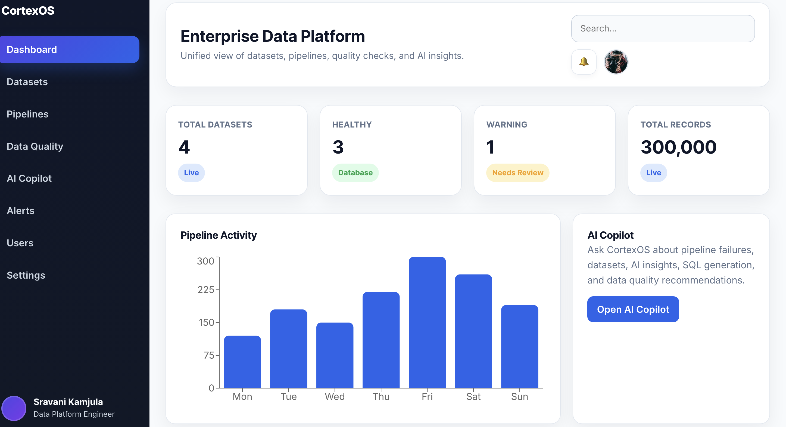
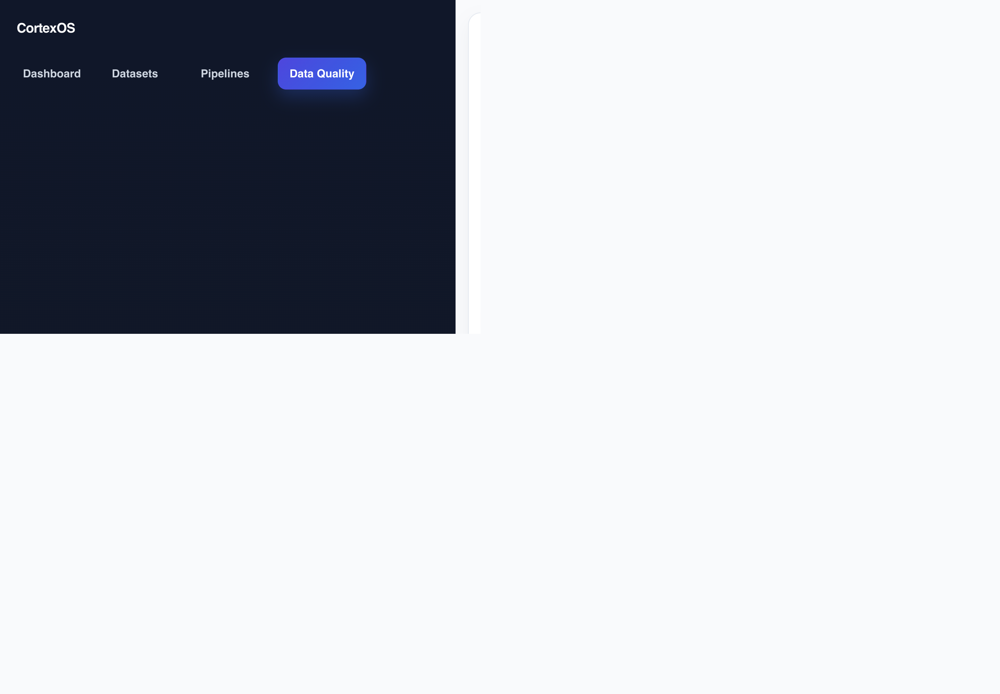
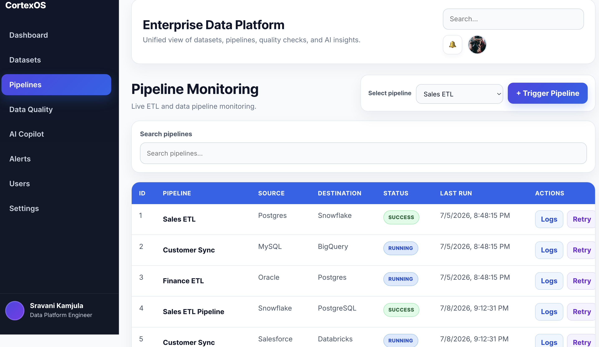
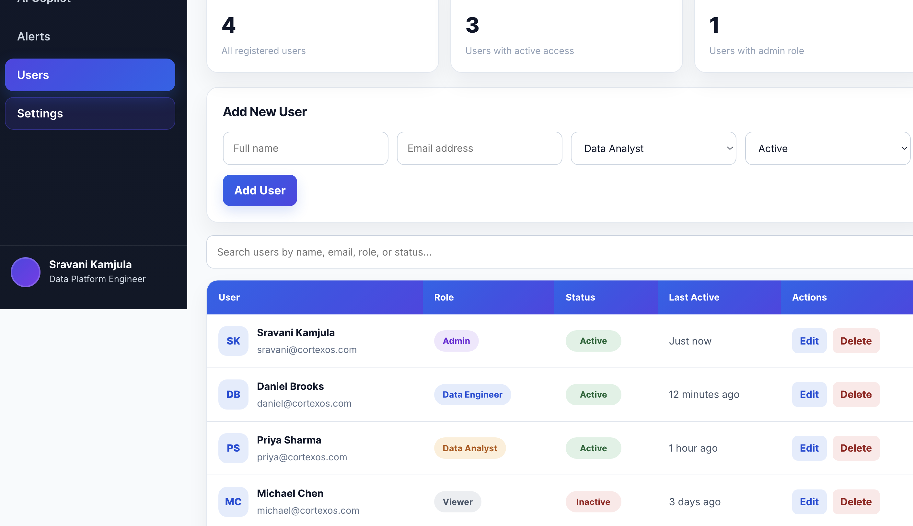

# CortexOS — Enterprise Data Platform

CortexOS is an enterprise-style full-stack data platform built with React, Node.js, Express, and PostgreSQL. It currently supports live dataset management and includes prototype interfaces for pipeline monitoring, data quality, and AI-assisted workflows.

## Tech Stack

- Frontend: React 19, Vite, Recharts, Lucide Icons

- Backend: Node.js, Express 5

- Database: PostgreSQL

## Project Status

| Feature | Status |
|---|---|
| Dataset Management | Functional |
| Pipeline Monitoring | UI Prototype |
| Data Quality | UI Prototype |
| AI Copilot | UI Prototype |
| Alerts | In Progress |
| Users, Settings, Authentication | Planned |

## Current Features

- **Dataset Management (fully functional):** Create, read, update, and delete datasets via a REST API backed by PostgreSQL.
- **Pipeline Monitoring (UI preview):** Dashboard view for pipeline runs and statuses. Currently displays sample data; live backend integration is planned.
- **Data Quality Dashboard (UI preview):** Visual quality-score dashboard per dataset. Currently displays sample data; live backend integration is planned.
- **AI Copilot (UI preview):** Chat-style interface for asking questions about your data. Currently a front-end prototype; AI/backend integration is planned.

## Roadmap

See the [open issues](https://github.com/kamjula/cortex-enterprise/issues) for in-progress and planned work, including Alerts CRUD, User Management, a Settings page, Login/JWT authentication, Role-Based Access Control, deployment configuration, and improved loading/empty/error states.

## Getting Started

### Prerequisites
- Node.js (v18+)
- PostgreSQL (running locally or remotely)

### Backend Setup
```bash
cd backend
npm install
```

Create a `backend/.env` file with the following variables:
```env
DB_HOST=localhost
DB_PORT=5432
DB_USER=your_db_user
DB_PASSWORD=your_db_password
DB_NAME=cortexos
```

Then run:
```bash
npm run dev
```

### Frontend Setup
```bash
cd frontend
npm install
npm run dev
```

## Screenshots

### Dashboard



### Data Quality



### Pipelines



### Alerts



## License

This project is currently shared for portfolio and educational purposes.
